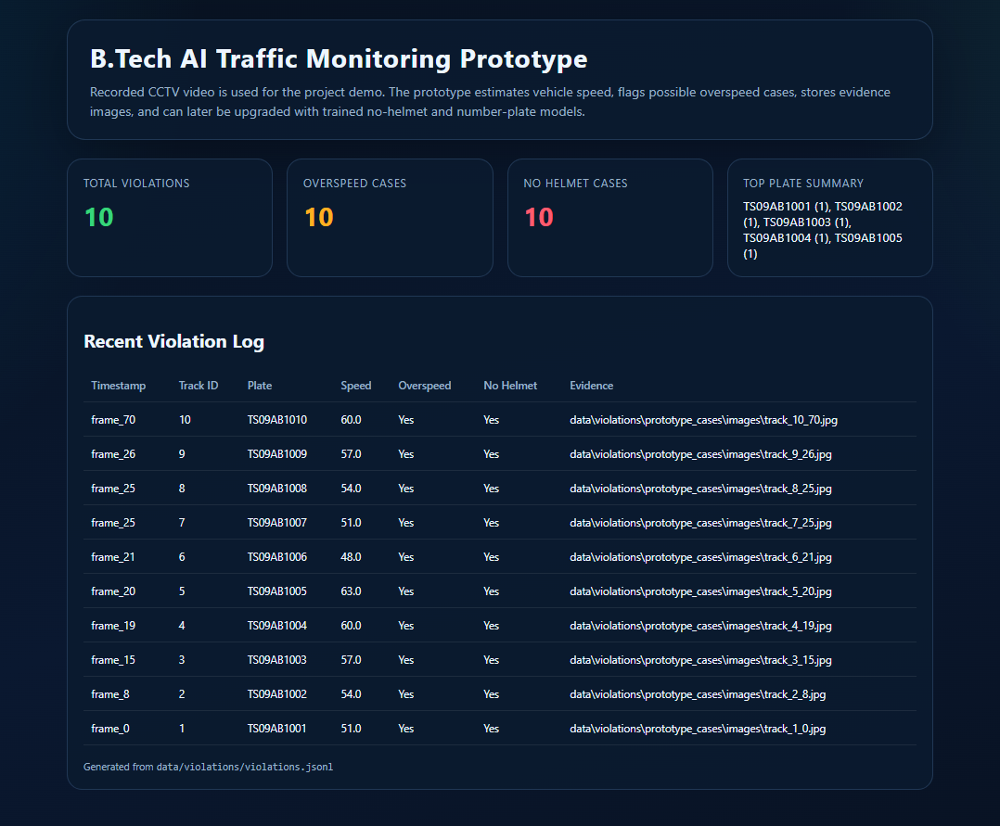

# 🚦 Smart Traffic Violation Detection System

## 🔍 Overview

An AI-based prototype system designed to detect vehicle speed and helmet violations using computer vision techniques. The system processes video data, identifies violations, and displays results through a dashboard interface with evidence images.

---

## 🚀 Features

* 🚗 Vehicle speed violation detection
* 🪖 Helmet violation detection
* 📸 Evidence image capture
* 📊 Dashboard visualization using HTML
* ⚡ Prototype-based processing with stored results

---

## 🧠 Project Type

Prototype-based AI traffic violation detection system with dashboard visualization.

---

## ⚙️ How It Works

* Video data is processed using YOLOv8 object detection
* Vehicles and riders are analyzed for violations
* Detected violations are stored as images
* Violation data is saved in JSON format
* Dashboard reads JSON data and displays results

---

## 🛠️ Tech Stack

* Python
* OpenCV
* YOLOv8
* HTML, CSS
* JSON

---

## 📂 Project Structure

smart-traffic-violation-detection/
│
├── data/
│   └── violations/
│       └── prototype_cases/
│           ├── images/
│           ├── dashboard.html
│           └── violations.json
│
├── config.yaml
├── requirements.txt
├── README.md

---

## ▶️ How to Run

1. Navigate to:
   data/violations/prototype_cases/

2. Open:
   dashboard.html

3. View detected violations and evidence images in the browser

---

## 📸 Dashboard Preview

---

## 📦 Model

Download YOLOv8 model from:
https://github.com/ultralytics/ultralytics

---

## 🚀 Future Improvements

* Real-time video processing
* Number plate recognition (ANPR)
* Cloud deployment
* Live dashboard integration

---

## 👤 Author

Sairam Chandu
